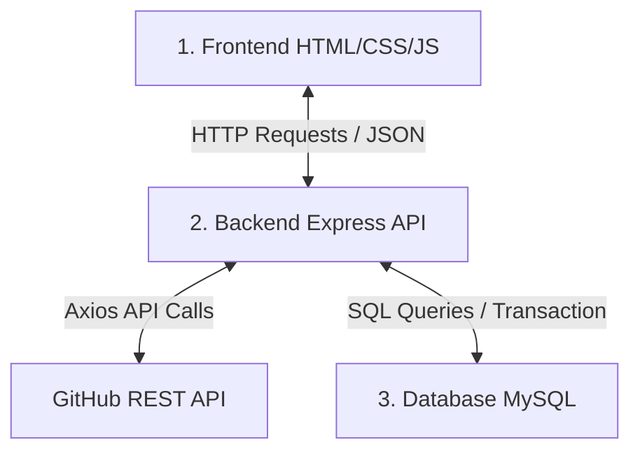

# Beginner's Guide to the GitHub Profile Analyzer

Welcome to the **GitHub Profile Analyzer**! This guide is designed specifically for beginners to understand the high-level architecture, directory layout, core backend concepts, database handling, and how the frontend interacts with the server.

---

## 1. High-Level Architecture

This application is built using a classic **Three-Tier Architecture**:



### The Flow of Data
1. **User Action**: A user types `torvalds` into the input bar in the browser (Frontend) and clicks **Analyze Profile**.
2. **API Request**: The browser makes a `GET` request to the backend: `/api/github/analyze/torvalds`.
3. **Routing & Handling**: Express routing maps this path to the `analyzeProfile` method in `githubController.js`.
4. **External API Retrieval**: The backend (`githubService.js`) uses `axios` to make parallel requests to the actual GitHub API:
   - Fetches profile info from: `https://api.github.com/users/torvalds`
   - Fetches repository data from: `https://api.github.com/users/torvalds/repos`
5. **Analytics Calculation**: The backend (`calculateInsights.js`) takes the raw data and computes:
   - **Popularity Score**: `(followers * 10) + stars`
   - **Activity Score**: `repos + (forks * 2) + gists`
   - **Developer Tier**: `S` (> 1000 score), `A` (> 700), `B` (> 400), or `C` (default).
6. **Database Persistence**: The backend (`githubModel.js`) initiates a transaction to store or update the developer details and their top 5 repositories in the MySQL tables.
7. **Response & Rendering**: The backend returns the structured JSON data back to the frontend. The frontend dynamically parses the JSON and updates the dashboard without reloading the page!

---

## 2. Directory and File Breakdown

Here is a map of the repository's files and what they do:

```text
├── public/                     # FRONTEND ASSETS
│   ├── index.html              # Structural HTML containing search & dashboard panels
│   ├── style.css               # Styling: Dark theme HSL color system & Glassmorphism templates
│   └── app.js                  # Client JavaScript: Handles search, fetch, and DOM updates
│
├── src/                        # BACKEND APPLICATION
│   ├── config/
│   │   └── db.js               # Database: MySQL connection pool and auto-table generation
│   ├── controllers/
│   │   └── githubController.js # Directs flow: validates params, calls service/model, sends response
│   ├── middleware/
│   │   ├── errorMiddleware.js  # Global error handling catches exceptions gracefully
│   │   └── validationMiddleware.js # Input validator checks for valid GitHub usernames
│   ├── models/
│   │   └── githubModel.js      # Relational SQL: runs transaction queries against MySQL tables
│   ├── routes/
│   │   └── githubRoutes.js     # Express Router: maps URLs to controller operations
│   ├── services/
│   │   └── githubService.js    # External Requests: fetches profile and repos using Axios
│   ├── utils/
│   │   └── calculateInsights.js# Mathematical Formulas: computes analytical developer insights
│   ├── app.js                  # Express Configuration: global middleware, security headers, rate limiting
│   └── server.js               # Main Entrypoint: loads env variables, initializes DB, starts HTTP server
│
├── .env                        # Environment Variables (holds ports, database credentials, GitHub Token)
├── Dockerfile                  # Instructions to package our Express API in a container
├── docker-compose.yml          # Provisions local MySQL and Express containers in tandem
└── package.json                # Project dependencies (Express, MySQL2, Axios, Morgan, Helmet)
```

---

## 3. Core Coding Concepts Explained

### A. Asynchronous JavaScript (`async` / `await`)
When talking to databases or third-party APIs (like GitHub), operations don't finish instantly. JavaScript uses **Promises** to handle actions that take time.
- `async` marks a function as asynchronous, meaning it returns a Promise.
- `await` pauses execution until a Promise resolves (completes), allowing us to write asynchronous code that reads like synchronous code!

Example from `src/services/githubService.js`:
```javascript
// The "async" keyword lets us use "await" inside
async fetchProfileData(username) {
  // Promise.all runs both network requests in parallel for super speed!
  const [profileResponse, reposResponse] = await Promise.all([
    axios.get(`https://api.github.com/users/${username}`),
    axios.get(`https://api.github.com/users/${username}/repos`)
  ]);

  // Once both finish, we return the parsed data
  return {
    profile: profileResponse.data,
    repos: reposResponse.data
  };
}
```

### B. Relational MySQL Transactions
A **Transaction** ensures a group of database updates either **all succeed** or **all fail** (nothing is half-saved, which keeps data clean).
- `.beginTransaction()`: Starts the transaction group.
- `.commit()`: Permanently writes all changes to the database.
- `.rollback()`: Undoes all changes if an error occurs mid-way.

Example query from `src/models/githubModel.js`:
```javascript
// ON DUPLICATE KEY UPDATE: If profile exists, update their stats. If not, insert a new record!
const profileSql = `
  INSERT INTO github_profiles (github_id, username, popularity_score, developer_tier)
  VALUES (?, ?, ?, ?)
  ON DUPLICATE KEY UPDATE
    popularity_score = VALUES(popularity_score),
    developer_tier = VALUES(developer_tier);
`;
```

### C. Client-Side DOM Manipulation & Dynamic Fetching
In the frontend (`public/app.js`), we talk to our Express backend using the browser's built-in `fetch` API, and then update the page structure (DOM) dynamically.

```javascript
// Make an API request to our local Express server
const response = await fetch(`/api/github/profiles/torvalds`);
const result = await response.json();

if (result.success) {
  // Update the HTML text elements dynamically!
  document.getElementById('prof-name').textContent = result.data.name;
  document.getElementById('prof-popularity').textContent = result.data.popularity_score;
}
```

---

## 4. How to Run the Project (Step-by-Step)

### Option 1: Quickstart (Using the Pre-configured Online Database)
The project comes with a pre-configured, live cloud database on Railway in the `.env` file. You don't need to install or configure MySQL locally to start testing!

1. Open your terminal in the project directory.
2. Install the project dependencies:
   ```bash
   npm install
   ```
3. Run the development server:
   ```bash
   npm run dev
   ```
4. Open your browser and navigate to:
   ```text
   http://localhost:5000
   ```

### Option 2: Docker Environment (Database + API Locally)
If you have Docker installed on your computer, you can spin up a local MySQL instance and the Node.js API with a single command:

1. Open your terminal in the project root.
2. Spin up the containers:
   ```bash
   docker-compose up --build
   ```
3. Once the database and API containers report a successful connection, open your browser and navigate to:
   ```text
   http://localhost:5000
   ```

### Option 3: Manual Local MySQL Installation
If you prefer to run a database server directly on your operating system:

1. Install **MySQL Server** (Community Edition).
2. Open your MySQL client and run a command to create the database:
   ```sql
   CREATE DATABASE github_analyzer;
   ```
3. Open the `.env` file in the root of this project and comment out the `DATABASE_URL` line (by adding a `#` at the beginning of line 4).
4. Update the individual database variables:
   ```text
   DB_HOST=localhost
   DB_PORT=3306
   DB_USER=root            # Your MySQL Username
   DB_PASSWORD=yourpassword # Your MySQL Password
   DB_NAME=github_analyzer
   ```
5. Install packages and start the server:
   ```bash
   npm install
   ```
   ```bash
   npm run dev
   ```

---

## 5. Tips for Exploring the Code
- **Start at `server.js` and `app.js`**: Look at how Express is initialized and how static files in `/public` are mapped.
- **Inspect `routes/githubRoutes.js`**: See the URL configurations and middleware validation bindings.
- **Trace a Search in `public/app.js`**: Track how `analyzeUserProfile()` calls the Express API and feeds the progress stepper!
